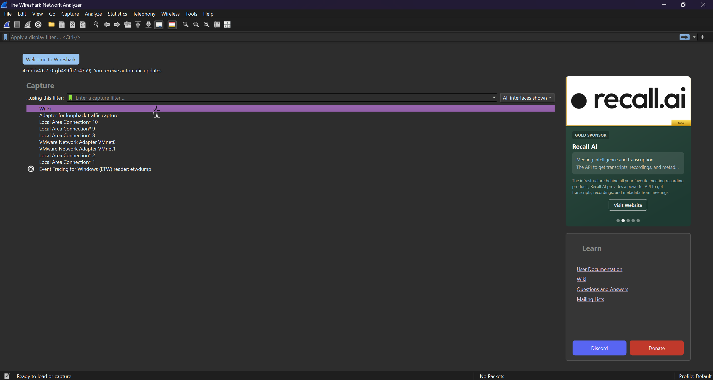
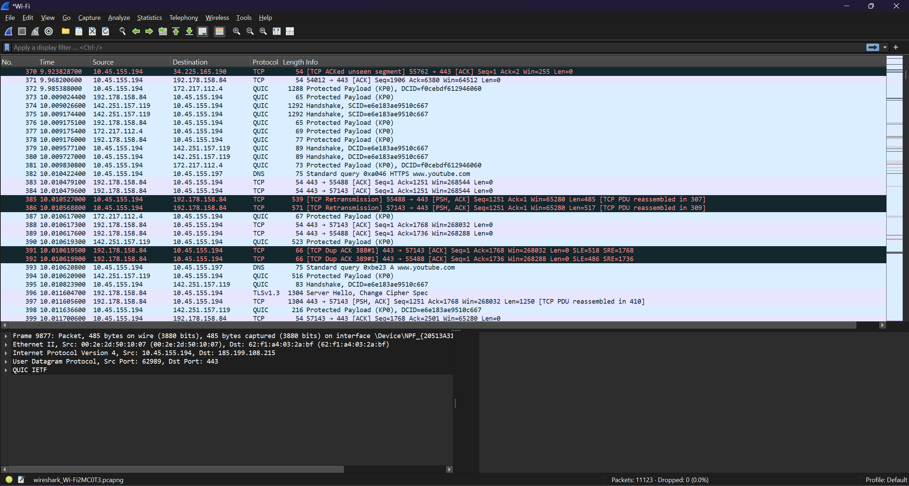
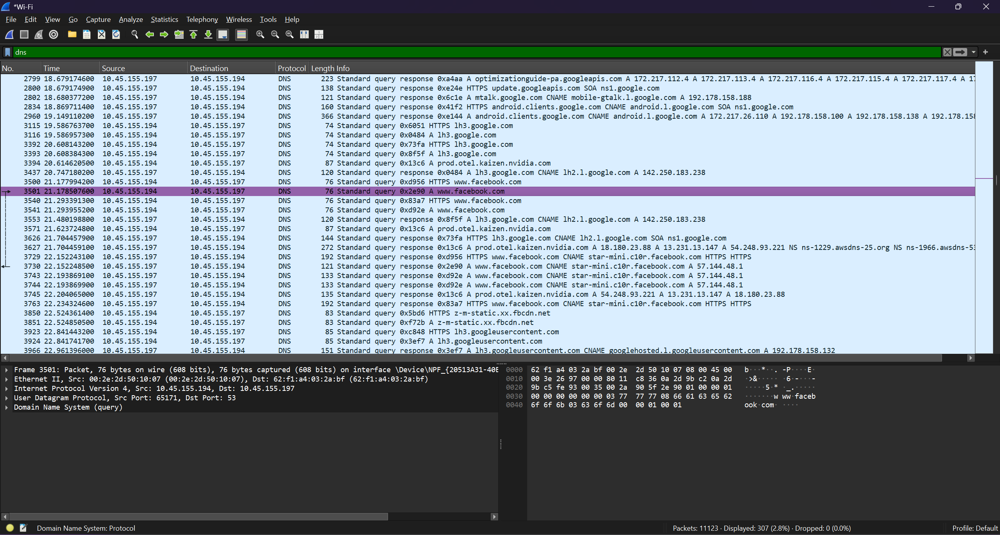
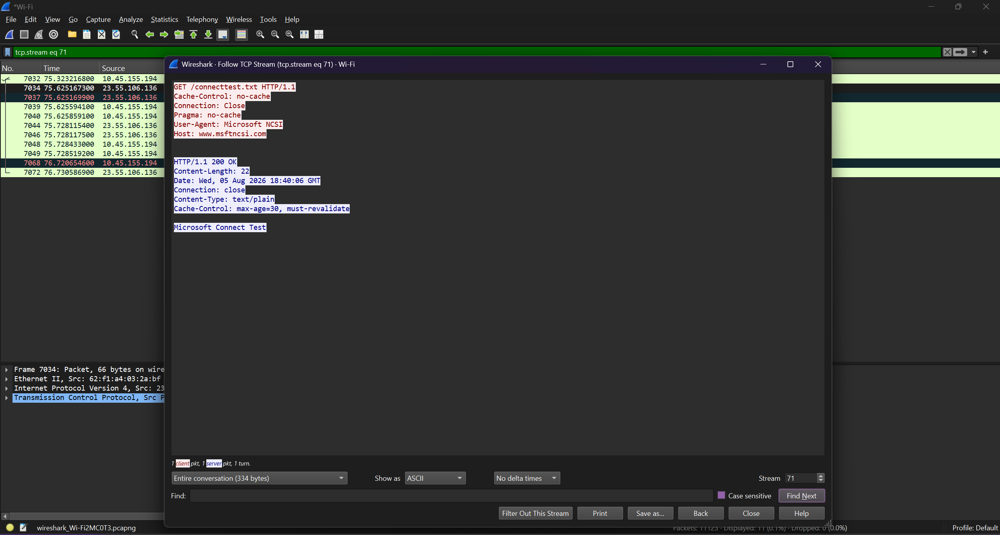
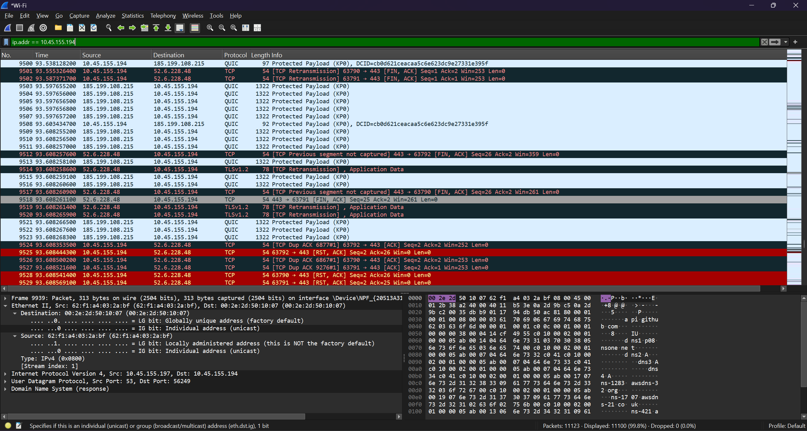

## Wireshark Interface

  0.1interface.png

   

### Observation
- Opened Wireshark and identified the active Wi-Fi interface.
- The interface showed live network activity, confirming it was ready for packet capture.
- No packets had been captured yet because the capture process had not started.
   

### Why is this important?
- Selecting the correct network interface is the first step in packet analysis.
- Choosing the wrong interface may result in capturing no useful traffics.
- VErifying Network activity helps ensure that the correct interface selected.
   

### What I learned
- How to identify the active network interfac.
- The importance of selecting the correct adapter before capturing traffics.
- Basic familiar with the wireshark interface and its available capture options.
 

## Live Packet Capture

  02-live_capture.png

   

### Observation
- Successfully captured live network traffic using the Wi-Fi interface.
- Multiple protocols such as TCP, DNS, QUIC, and TLS were observed during the capture session.
- The packet list shows communicaition between my local machine and multiple external servers.
- Different source and destination IP addresses indicate active network communication.
   

### Why is this important?
- Live packet capture providers a real-time view of network avtivity.
- It helps identity  which protocols  are being used by applications and services.
- This is the foundation for trounleshooting ans network issues and performing security analysis.
   

### What I Learned
- How to capture live network traffic using Wireshark.
- How to identify different protocols from the packet list.
- How to recognize communication between a local device and external servers using source and destination IP addresses.
 

## DNS Analysis

  03-dns.png

   
  
### Observation

- Applied the `dns` display filter to view only DNS packets.
- Multiple DNS queries and responses were captured during web browsing.
- The capture includes domain lookups such as `www.facebook.com` and various Google services.
- DNS response packets returned the IP addresses required to establish communication with the requested domains.

### Why is this important?

- DNS is responsible for tranalating domain names into IP addresses.
- Without DNS, users would need to access websites using IP addresses instead of domain names.
- Analyzing DNS traffic helps understand how systems locate and communicate with remote servers.

### What I learned

- How to filter DNS traffic using Wireshark.
- How to distinguish between DNS query and DNS response psckets.
- How domain name resolution works before a connection to a website is establoshed.
 

## TCP Stream Analysis

04-tcp_stream.png

### Observation
- Used the **Follow TCP Stream** feature to inspect the complete  communication between the client and the server.
- The stream display an HTTP request followed by an **HTTP/1.1 200 OK** response, indicating that the server processed the request successfully.
- Viewing the entire conversation made it easier to understand how data was exchanged during the session.
### Why is this important?
- Follwed a TCP stream combines related packets into a sinfle conversation made it easier to understand  how data was exhanaged during the sesssion.
- It helps investigators understand how the client and server communicate instead of examinig packet line by line.
- This featurer is commonly used during network troubleshooting and digital forensic investigation.
### What I Learned?
- How to use **Follow TCP Stream** feature in Wireshark.
- How to inspect a complete client-server conversation.
- How to identify a successful HTTP to identify a successful HTTP response (**'200 OK'**) within capture network traffic.
 

## PACKET DETAILS ANALYSIS

  05-packet_details.png

### Observation
- Examined the details sturcture of a captured DNS packet.
- The Packet is organized into multiple protocol layers, including Frame, Ethernet II, Ipv4, UDP and DNS.
- Each layer contains specific information required to deliver and the packets across the network.
